# Лабораторная работа №1
[Вернуться назад](../README.md)

### Выполнение

#### Логирование

1. Создали файлы docker-compose.yml, promtail_config.yml
2. Запустили compose файл командой `docker-compose up -d`
   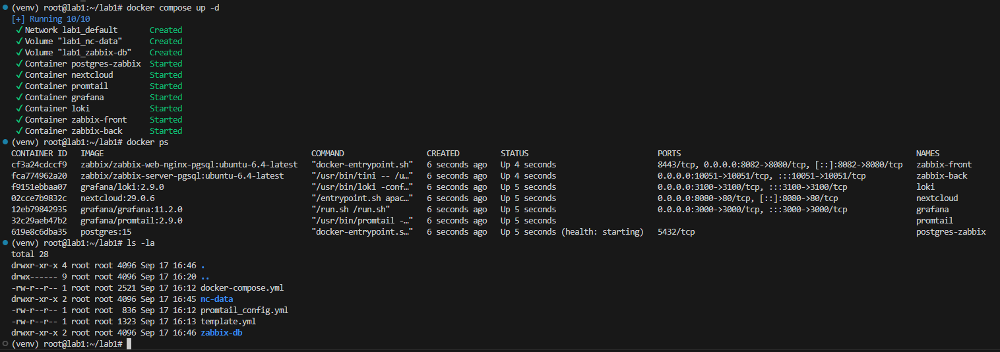
3. Заходим на nextcloud, Создаем админа
   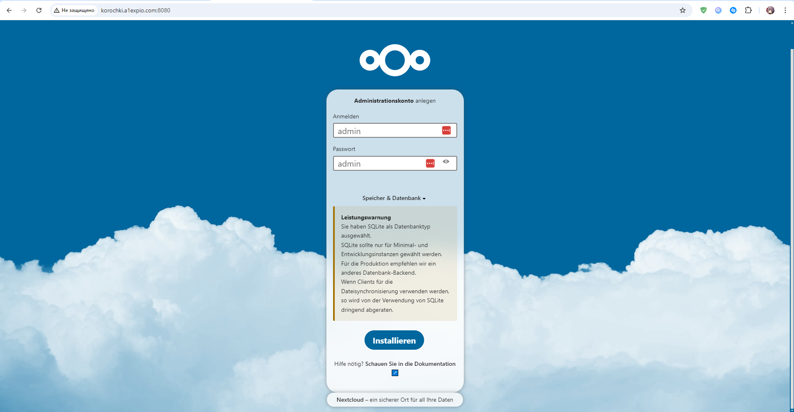
4. Смотрим логи
   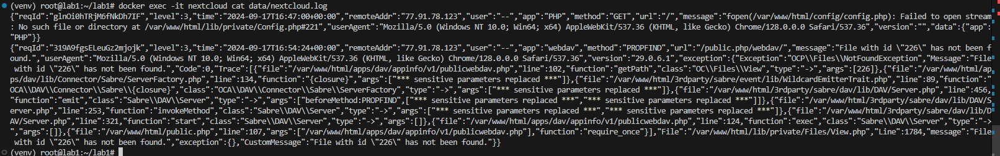
5. Проверяем, нашел ли promtail файл с логами от nextcloud:
   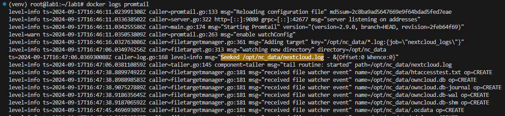

---

#### Мониторинг

1. Заходим в zabbix, импортируем template
   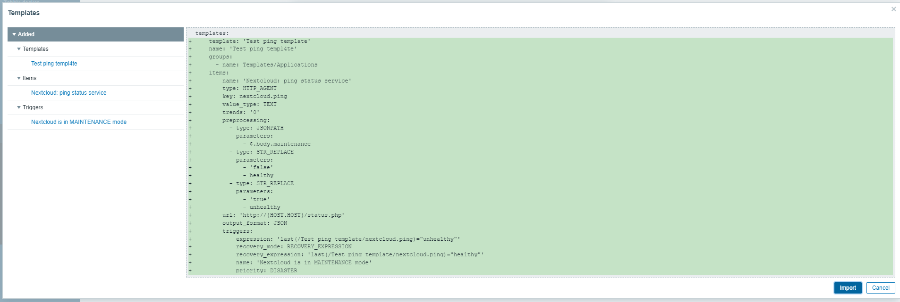
   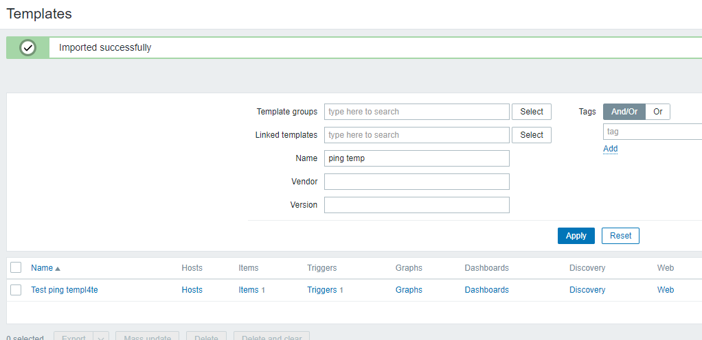
2. Командой `docker exec -u www-data nextcloud php occ config:system:set trusted_domains 1 --value="nextcloud"` разрешаем zabbix подключаться к nexcloud
3. Создаем хост, применяем к нему созданный template
4. Проверим, работает ли триггер, включая и выключая тех. работы в nextcloud
   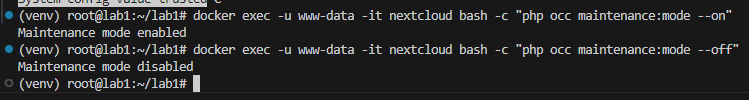

---

#### Визуализация

1. Устанавливаем плагин на zabbix для grafana
   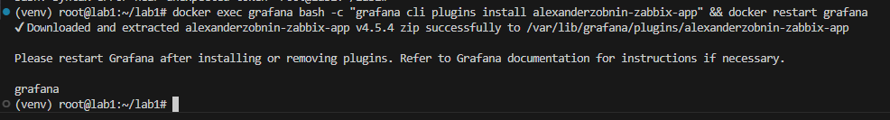
2. Заходим в grafana, включаем плагин
   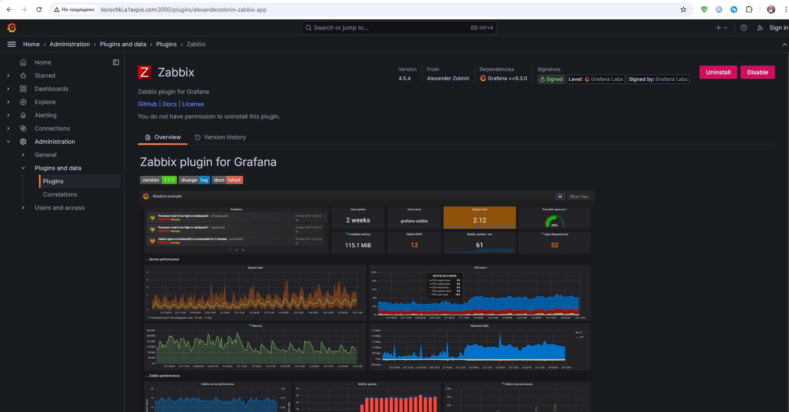
3. Подключаем Loki к Grafana  
   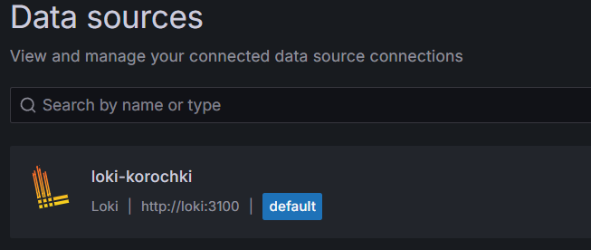
4. Подключаем zabbix к Grafana
   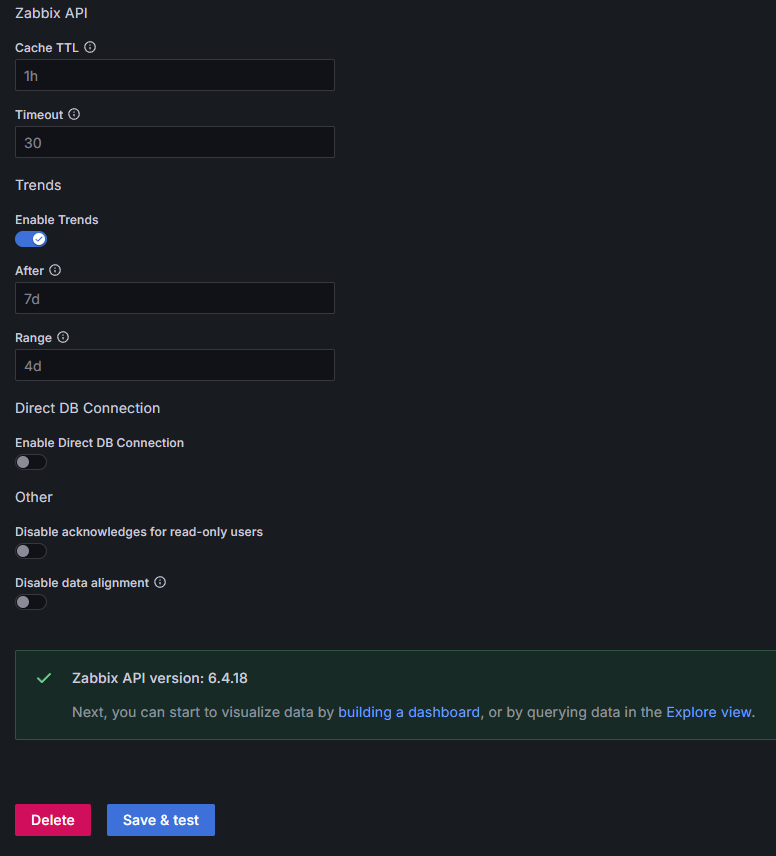
5. Создаем дашборд со статусом nextcloud из zabbix и логами из loki:
   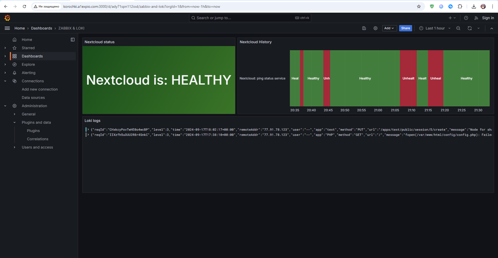

---

### Ответы на вопросы:

1. Чем SLO отличается от SLA?

SLO (Service Level Objective) — декларируемый уровень надёжности сервиса. Это желаемая цель, тот уровень качества, который хочет видеть наш клиент.  
SLI (Service Level Indicator) — фактическое состояние метрик. Это то, как работает сервис в реальности.  
SLA (Service Level Agreement) — договорённости или контракты о том, что делать, если SLI отличаются от SLO в худшую сторону. То есть, если сервис работает не так, как мы обещали.  

2. Чем отличается инкрементальный бэкап от дифференциального?

Инкрементальный обрабатывает файлы, измененные или созданные с момента выполнения предыдущего бэкапа;  
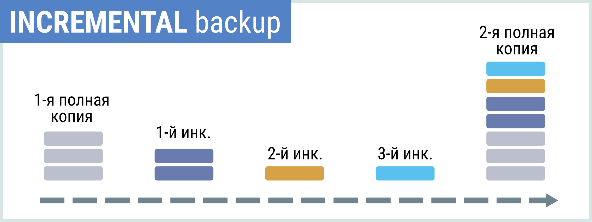
Дифференциальный обрабатывает файлы, измененные или созданные с момента выполнения предыдущего полного бэкапа.  
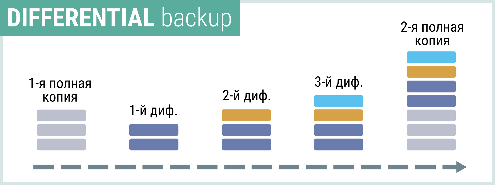

3. В чем разница между мониторингом и observability?

Мониторинг — это процесс отслеживания поведения системы через сбор определённых метрик и событий. Мониторинг отвечает на вопрос «что произошло?».  
Observability (наблюдаемость) — это процесс регулярной, всесторонней диагностики внутреннего состояния информационной системы на основе таких данных, как метрики, события, логи. Observability отвечает на вопрос «почему это произошло?» и «как именно это произошло?» 
