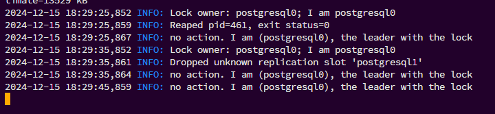

# Лабораторная работа №3

### Выполнение
#### Поднимаем Postgres
Были заполнены [`Dockerfile`](./Dockerfile), [`docker-compose.yml`](./docker-compose.yml), [`haproxy.cfg`](./haproxy.cfg) и `postgresX.yml` файлы в соответствии с заданием.  

  

Проверим логи контейнера `pg-master`:  
  
Как видим, эта реплика стала slave. И это не является ошибкой, поскольку невозможно наверняка угадать, какая реплика станет главной.  

---

#### Проверяем репликацию 
Воспользуемся Datagrip плагином, который встроен в PyCharm:  

  
  

Попробуем создать таблицу в главном узле (в нашем запуске - это `pg-slave`):  
  
  

Как видим, операция завершена успешно. А что, если мы попробуем сделать какие-нибудь изменения на `pg-master`, который в нашем случае играет роль последователя?  
  
Мы получили ошибку, так как наша реплика сейчас работает в режиме read-only.  

---

#### Делаем ~~среднего роста~~ высокую доступность
У нас уже настроен HAProxy. Наша задача протестировать его работоспособность.  
  
  
  

А теперь проверим, как работает наша система, если отключится мастер нода:  
  

Потеряв ноду `pg-slave`, нода `pg-master` взяла на себя главную роль:  
  

В это же время подключение через HAProxy продолжает функционировать:  
  

---

#### Восстановление ноды
Попробуем изменить данные в нашей мастер ноде, а после попробуем включить слейв ноду:  
  
  

Как видим, нода `pg-slave` приняла роль read-only, поскольку место мастера уже занято:  
  

А также в `pg-slave` были переданы те данные, которые мы ввели в `pg-master` во время того, как `pg-slave` был выведен из строя:  
  

---

### Ответы на вопросы:
1. Порты 8008 и 5432 вынесены в разные директивы, expose и ports. По сути, если записать 8008 в ports, то он тоже станет exposed. В чем разница?

Порт 5432 пробрасывается наружу, то есть по нему можно достучаться извне (localhost, например). Тогда как expose позволяет получить доступ к порту контейнера только другим контейнерам в этой сети.

2. При обычном перезапуске композ-проекта, будет ли сбилден заново образ? А если предварительно отредактировать файлы postgresX.yml? А если содержимое самого Dockerfile? Почему?

* `docker-compose`: **Нет.** Docker Compose использует уже существующий образ, если он не изменился. 
* `postgresX.yml`: **Нет.** Изменение файлов `postgresX.yml` не влияет на пересборку образа.
* `Dockerfile`: 
  * **Да**, если запустить Docker Compose с флагом `--build`.
  * **Нет**, если запустить без флага: Docker Compose продолжит использовать старый образ.